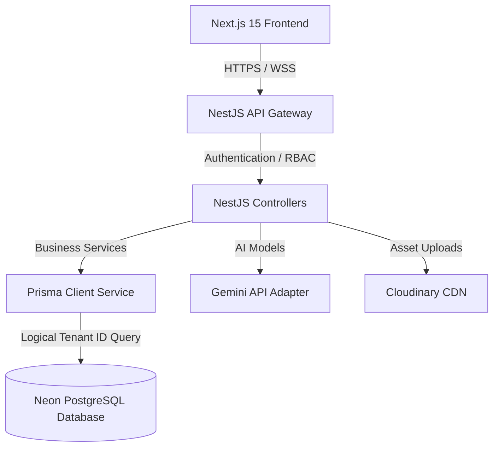

# Technical Architecture Specification - PropFlow AI

## 1. System Topology Overview
PropFlow AI employs a multi-tenant monorepo structure consisting of a Next.js 15 App Router Frontend, a NestJS Backend, and a shared PostgreSQL schema layer. 

---

## 2. Multi-Tenancy Architecture
We implement logical **Row-Level multi-tenancy** using a shared-database and shared-schema layout:
- **Tenant Context Identification**: Every user session maps back to an `organizationId` claims payload inside their JWT profile.
- **Auto-Filtering Interceptors**: The backend interceptors ensure that `organizationId` is automatically injected into all database operations, avoiding raw SQL manual bindings and preventing manual developer slip-ups.

---

## 3. Tech Stack Mappings
- **Frontend**: Next.js 15, TypeScript, Tailwind CSS, Lucide icons, Recharts.
- **Backend**: NestJS, Prisma ORM, JSON Web Token (`@nestjs/jwt`), class-validator.
- **Databases**: Neon PostgreSQL, Redis (job queues and caching).
- **AI Core**: Gemini API wrapped in NestJS AI modules.
- **Object Storage**: Cloudinary SDK integrations.
