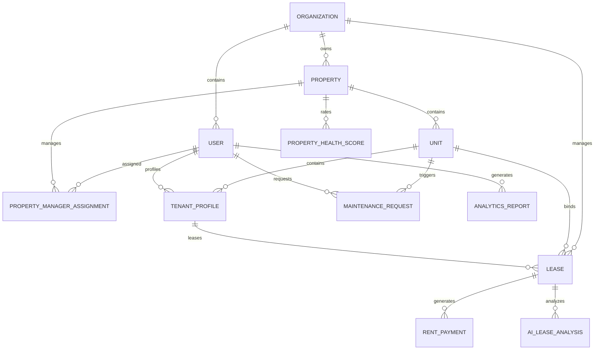

# Database Specification - PropFlow AI

## 1. Schema & Relational Model
The schema maps multi-tenancy configurations, user records, lease specifications, billing details, maintenance requests, and AI analytics metrics using PostgreSQL.

---

## 2. Critical Database Tables

### `User`
- Holds account state, secure hashes, and tenancy scope.
- **Indices**: Unique constraint on `email`, composite index on `(id, organizationId)`.

### `Property` & `Unit`
- Represent assets. Property belongs directly to an `organizationId`. 
- **Indices**: Composite index on `(id, organizationId)`.

### `Lease` & `RentPayment`
- Define tenancy duration and legal limits. Lease holds standard metadata plus the document URL of the digitized lease in Cloudinary.
- **Indices**: Composite indices on `(unitId, tenantProfileId)` and `(leaseId, status)`.

---

## 3. Query Optimization Strategies
1. **Foreign Key Indices**: Every relation key possesses an explicit single-field index.
2. **Partial Indices**: Indices are optimized on statuses (e.g., `status = 'PENDING'` for payments) to speed up ledger loading times.
3. **Prepared Statements**: Prisma automatically caches raw SQL query plans, reducing overall network roundtrips.
